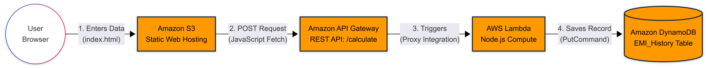

# Cloud Hosted EMI Calculator

A cloud-hosted EMI calculator built by migrating a static, client-side project to an AWS serverless architecture. The application keeps the frontend fast and lightweight while adding a secure, scalable backend that captures and permanently stores calculation records.

## Objective

The objective of this project is to demonstrate AWS proficiency by evolving a static EMI calculator into a cloud-native serverless web application. It showcases static website hosting, REST API integration, event-driven compute, NoSQL persistence, cross-origin communication, and least-privilege access control.

## Services Used

| AWS service | Role in the solution |
| --- | --- |
| **Amazon S3** | Hosts the static frontend assets, including `index.html`, `styles.css`, and `script.js`, using S3 Static Website Hosting. Bucket versioning helps protect the frontend files from accidental deletion or replacement. |
| **Amazon API Gateway** | Provides the regional REST API and exposes the `POST /calculate` endpoint. Lambda proxy integration forwards the complete request to the backend function, while CORS allows the S3-hosted frontend to call the API. |
| **AWS Lambda** | Runs the serverless backend using Node.js. The `SaveEMICalculation` function parses the request, generates a unique calculation ID and timestamp, maps the EMI data, and writes the completed record to DynamoDB. |
| **Amazon DynamoDB** | Permanently stores calculation history in the `EMI_History` NoSQL table. Each item uses `calculationId` as its string partition key, and On-Demand capacity automatically adapts to the application's request volume. |
| **AWS Identity and Access Management (IAM)** | Enforces least-privilege security through a dedicated Lambda execution role. The role permits CloudWatch logging and grants only `dynamodb:PutItem` access to the specific `EMI_History` table. |

## Architecture & Flow

<!-- Cntrl+click emi.png -->

  

### What happens when the user clicks Calculate?

1. The browser calculates the EMI, total interest, and total payment from the principal amount, interest rate, and loan tenure.
2. The frontend creates a JSON payload containing the input values and calculated results.
3. After the configured debounce interval, the frontend sends the payload to API Gateway using `POST /calculate`. Debouncing prevents rapid slider changes from creating unnecessary API requests.
4. API Gateway handles REST routing and forwards the request to Lambda through Lambda proxy integration.
5. The Node.js Lambda function parses the payload, creates a UUID-based `calculationId`, adds an ISO timestamp, and prepares the DynamoDB item.
6. Lambda uses its least-privilege IAM role to perform `dynamodb:PutItem` on the `EMI_History` table.
7. DynamoDB permanently stores the calculation record, including the principal, interest rate, tenure, EMI, total interest, and total payment.
8. Lambda returns a JSON success or error response through API Gateway, with the required CORS headers for the S3-hosted frontend.

## Cost Analysis

1. This entire architecture operates within the AWS Free Tier. DynamoDB utilizes On-Demand capacity, and Lambda/API Gateway operate well within their monthly free invocation limits.

2. Actual charges depend on AWS account eligibility, region, traffic, storage, data transfer, and current AWS pricing. AWS Budgets and billing alerts should be configured before deployment.
